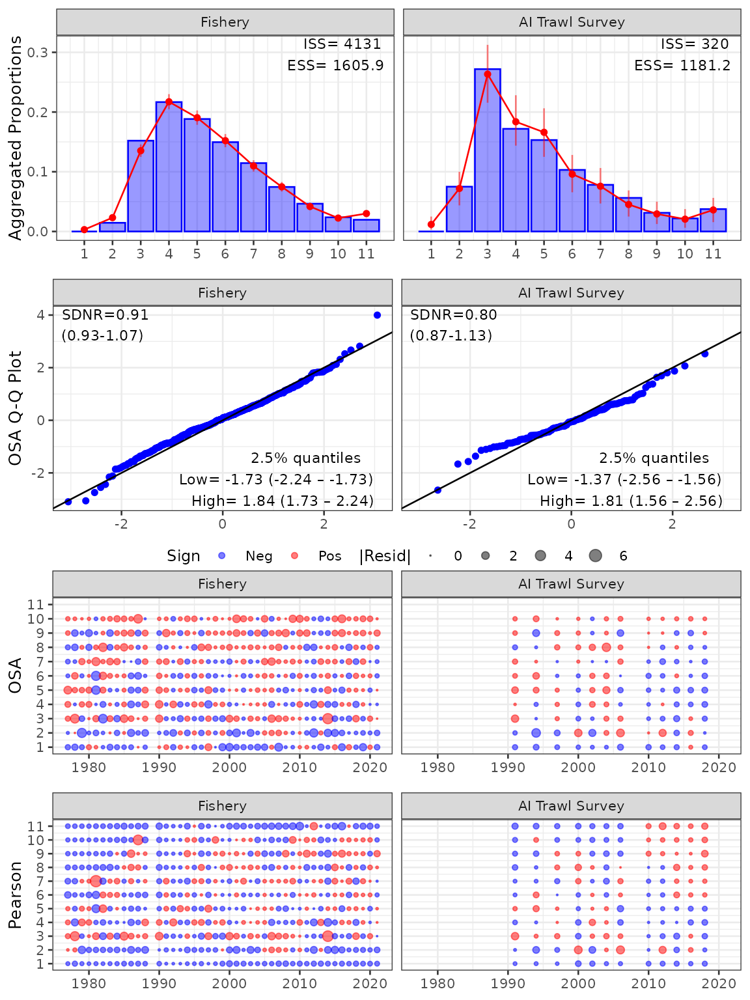

# AMAK (BSAI Atka mackerel)

## Getting started with `{afscOSA}`

To get started you’ll need to install
[afscOSA](https://github.com/noaa-afsc/afscOSA), which also relies on
`{compResidual}`. To install these libraries from Github, using the
following commands:

``` r


# downloading compResidual:
# https://github.com/fishfollower/compResidual#composition-residuals for
# installation instructions

# TMB:::install.contrib("https://github.com/vtrijoulet/OSA_multivariate_dists/archive/main.zip")
# remotes::install_github("fishfollower/compResidual/compResidual", force=TRUE)

# remotes::install_github("noaa-afsc/afscOSA", force=TRUE)

library(afscOSA)
```

In this vignette we show how to
[afscOSA](https://github.com/noaa-afsc/afscOSA) with an AMAK ADMB model
using the BSAI Atka mackerel assessment model as an example.

Once the data is loaded, the general workflow is as follows:

1.  Structure the observed and predicted age/length compositions as
    matrices with `nrows` = number of years and `ncols` = number of age
    or length bins.

2.  Calculate OSA residuals for each fleet using
    [`run_osa()`](https://noaa-afsc.github.io/afscOSA/reference/run_osa.md).
    See details for inputs and outputs by running `??run_osa()`.

3.  Plot OSA residuals and aggregate fits for one or more fits using
    [`plot_osa()`](https://noaa-afsc.github.io/afscOSA/reference/plot_osa.md).
    Input to
    [`plot_osa()`](https://noaa-afsc.github.io/afscOSA/reference/plot_osa.md)
    is a list of output(s) from
    [`run_osa()`](https://noaa-afsc.github.io/afscOSA/reference/run_osa.md).
    See more details by running `??plot_osa`.

``` r

# load Atka mackerel data
amrep <- afscOSA::bsaiamrep
amdat <- afscOSA::bsaiamdat

# fishery
ages <- 1:11
yrs <- amrep$pobs_fsh_1[,1]
obs <- amrep$pobs_fsh_1[,2:12]
exp <- amrep$phat_fsh_1[,2:12]
N <- amdat$sample_ages_fsh
out1 <- run_osa(fleet = 'Fishery', index_label = 'Age',
                obs = obs, exp = exp, N = N, index = ages, years = yrs)

# survey
yrs <-  amrep$pobs_ind_1[,1]
obs <- amrep$pobs_ind_1[,2:12]
exp <- amrep$phat_ind_1[,2:12]
N <- amdat$sample_ages_ind
out2 <- run_osa(fleet = 'AI Trawl Survey', index_label = 'Age',
                obs = obs, exp = exp, N = N, index = ages, years = yrs)

input <- list(out1, out2)
osaplots <- plot_osa(input)
```


