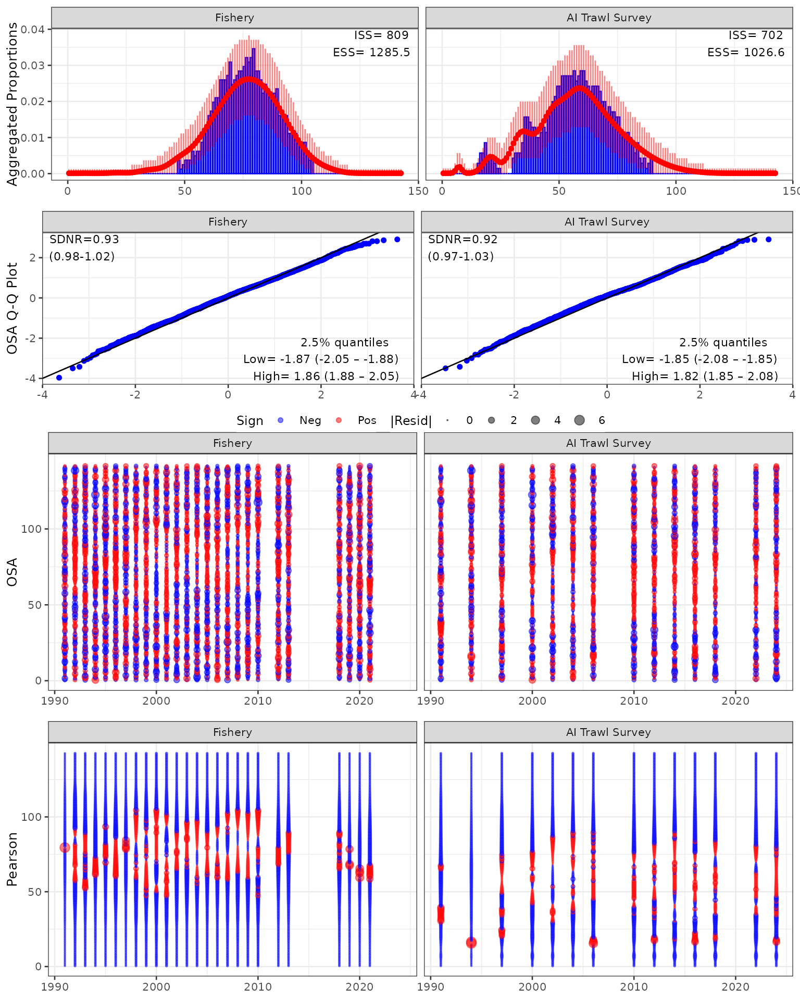
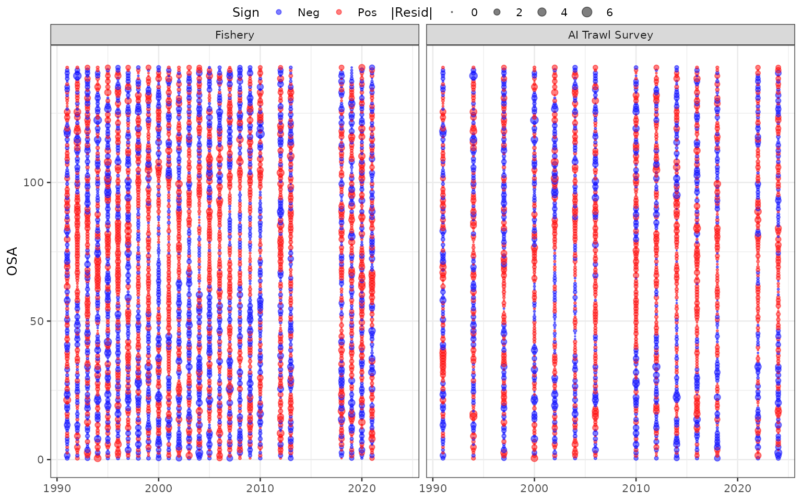
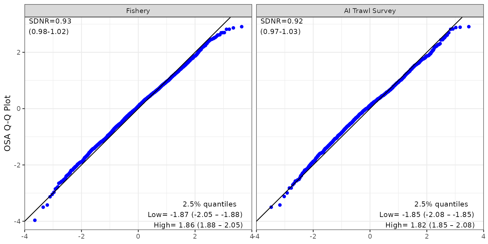
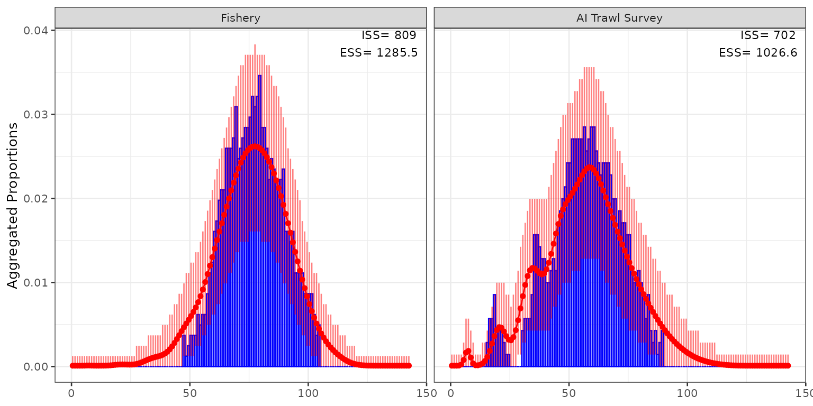

# SS3 (AI Pacific cod)

## Getting started with `{afscOSA}`

To get started you’ll need to install
[afscOSA](https://github.com/noaa-afsc/afscOSA), which also relies on
`{compResidual}`. To install these libraries from Github, using the
following commands:

``` r


# downloading compResidual:
# https://github.com/fishfollower/compResidual#composition-residuals for
# installation instructions

# TMB:::install.contrib("https://github.com/vtrijoulet/OSA_multivariate_dists/archive/main.zip")
# remotes::install_github("fishfollower/compResidual/compResidual", force=TRUE)

# remotes::install_github("noaa-afsc/afscOSA", force=TRUE)

library(afscOSA)
```

In this vignette we show how to
[afscOSA](https://github.com/noaa-afsc/afscOSA) with a Stock Synthesis
(SS3) model using the Aleutian Islands Pacific cod assessment model as
an example. For that reason, you’ll also also need the
[r4ss](https://github.com/r4ss/r4ss) library.

``` r


# remotes::install_github("r4ss/r4ss", force=TRUE)

library(r4ss)
#> 
#> Attaching package: 'r4ss'
#> The following object is masked from 'package:stats':
#> 
#>     profile
#> The following object is masked from 'package:base':
#> 
#>     jitter
```

Once the data is loaded, the general workflow is as follows:

1.  Structure the observed and predicted age/length compositions as
    matrices with `nrows` = number of years and `ncols` = number of age
    or length bins.

2.  Calculate OSA residuals for each fleet using
    [`run_osa()`](https://noaa-afsc.github.io/afscOSA/reference/run_osa.md).
    See details for inputs and outputs by running `??run_osa()`.

3.  Plot OSA residuals and aggregate fits for one or more fits using
    [`plot_osa()`](https://noaa-afsc.github.io/afscOSA/reference/plot_osa.md).
    Input to
    [`plot_osa()`](https://noaa-afsc.github.io/afscOSA/reference/plot_osa.md)
    is a list of output(s) from
    [`run_osa()`](https://noaa-afsc.github.io/afscOSA/reference/run_osa.md).
    See more details by running `??plot_osa`.

``` r


sx = 1 # USER INPUT define sex
fleet = c(1,2) # USER INPUT define fleets

# use dirvec argument to point to the directory with your SS3 output files
mod <- r4ss::SSgetoutput()
#> ℹ reading output from /home/runner/work/afscOSA/afscOSA/vignettes/Report.sso
#> ℹ added element 'replist1' to list

# comps for the fleets defined in "fleet" and "sx"
comps <- as.data.frame(mod[[1]]$lendbase[,c(1,6,13,16:18)])
comps <- comps[comps$Fleet %in% fleet & comps$Sex %in% sx, ]
comps <- reshape2::melt(comps,id.vars = c('Yr','Fleet','Sex','Bin'))

# input sample sizes for the fleets defined in "fleet" and "sx"
Ndf <- as.data.frame(mod[[1]]$lendbase[,c(1,6,13,16,20,22)])
Ndf <- Ndf[Ndf$Bin == min(Ndf$Bin),]

# length bins
lens <- sort(unique(comps$Bin))

# fishery (fleet 1) ----

flt <- 1 # USER INPUT

# this is a 1 sex model but if it had sex structure you would define each sex as
# a separate fleet (e.g., Fishery F and Fishery M)
tmp <- comps[comps$Fleet==flt,]

# input sample sizes (vector)
N <- Ndf$Nsamp_adj[Ndf$Fleet==flt]

# observed values -> put in matrix format (nrow = nyr, ncol = age/length)
obs <- tmp[tmp$variable=='Obs',]
obs <- reshape2::dcast(obs, Yr~Bin, value.var = "value")
yrs <- obs$Yr # years sampled
obs <- as.matrix(obs[,-1])

# expected values -> put in matrix format (nrow = nyr, ncol = age/length
exp <- tmp[tmp$variable=='Exp',]
exp <- reshape2::dcast(exp, Yr~Bin, value.var = "value")
exp <- as.matrix(exp[,-1])

# should all be true!
stopifnot(all(length(N) == length(yrs), length(N) == nrow(obs), nrow(obs) == nrow(exp)))

out1 <- afscOSA::run_osa(fleet = 'Fishery', index_label = 'Length',
                         obs = obs, exp = exp, N = N, index = lens, years = yrs)
#> [1] "Excluded years where N < 1: 2011, 2014, 2015, 2016, 2017, 2022, 2023, 2024"


# AI bottom trawl survey (fleet 2) ----

flt <- 2 # USER INPUT

# this is a 1 sex model but if it had sex structure you would define each sex as
# a separate fleet (e.g., Survey F and Survey M)
tmp <- comps[comps$Fleet==flt,]

# input sample sizes (vector)
N <- Ndf$Nsamp_adj[Ndf$Fleet==flt]

# observed values -> put in matrix format (nrow = nyr, ncol = age/length)
obs <- tmp[tmp$variable=='Obs',]
obs <- reshape2::dcast(obs, Yr~Bin, value.var = "value")
yrs <- obs$Yr # years sampled
obs <- as.matrix(obs[,-1])

# expected values -> put in matrix format (nrow = nyr, ncol = age/length
exp <- tmp[tmp$variable=='Exp',]
exp <- reshape2::dcast(exp, Yr~Bin, value.var = "value")
exp <- as.matrix(exp[,-1])

# should all be true!
length(N) == length(yrs); length(N) == nrow(obs); nrow(obs) == nrow(exp)
#> [1] TRUE
#> [1] TRUE
#> [1] TRUE
ncol(obs);ncol(exp);length(lens)
#> [1] 143
#> [1] 143
#> [1] 143

out2 <- afscOSA::run_osa(fleet = 'AI Trawl Survey', index_label = 'Length',
                         obs = obs, exp = exp, N = N, index = lens, years = yrs)

# plot results ----
input <- list(out1, out2)
osaplots <- plot_osa(input)
#> Warning in plot_osa(input): The following Pearson residuals were set to 6 for
#> plotting: 6.9 17.4 13.59
```



Note on Residual Truncation: The warning above indicates that extreme
Pearson residuals (e.g., 6.9, 17.4, 13.59) were capped at 6 for
visualization. Truncating extreme outliers prevents them from
compressing the overall scale, allowing residual patterns across age
bins and years to remain clearly legible and directly comparable across
different assessment models. This example also has several years where
the sample size is less than one and those are filtered out prior to
residual and aggregate calculations.

`"Excluded years where N < 1: 2011, 2014, 2015, 2016, 2017, 2022, 2023, 2024"`

There are a lot of length bins in this Pacific cod example, making
examination of individual residuals challenging. To help with this, the
user can extract the different plotting components:

``` r

osaplots <- plot_osa(input, use_agg_proportions=TRUE, plot=FALSE)
#> Warning in plot_osa(input, use_agg_proportions = TRUE, plot = FALSE): The
#> following Pearson residuals were set to 6 for plotting: 6.9 17.4 13.59
osaplots$bubble
```



``` r

# osaplots$bubble_pearson
```

``` r

osaplots$qq
```



``` r

osaplots$aggcomp
```


