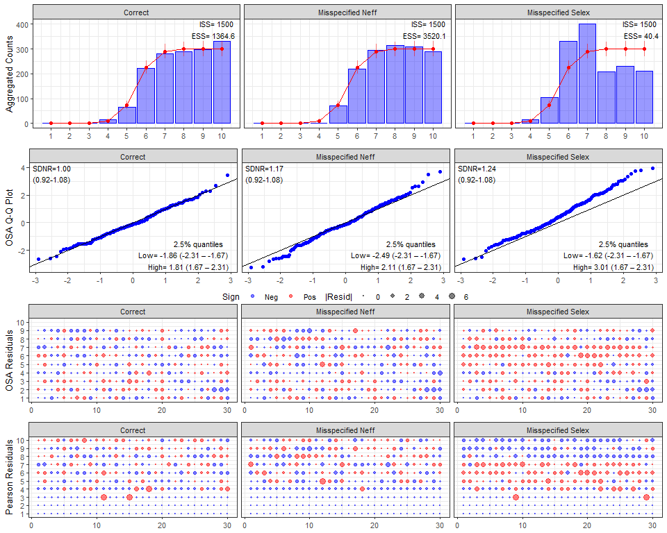

# afscOSA 

## Overview

afscOSA is an R library that produces one step ahead (OSA) residual
diagnostic plots for composition data fit in fisheries stock assessments
at the Alaska Fisheries Science Center (AFSC). OSA residuals are
computed using the `{compResidual}` R library (Trijoulet and Nielsen,
2022; Trijoulet et al., 2023). OSA residuals are available in
[afscOSA](https://github.com/noaa-afsc/afscOSA) for composition data fit
assuming a multinomial or Dirichlet-multinomial distribution from purely
fixed effects assessment models.

For each data set (i.e., fleet), the output includes plots of the fit to
aggregate compositions across years, a Q-Q plot of OSA residuals, and
bubble plots for OSA and Pearson residuals. OSA residuals will be
standard normal under a correctly specified model and so statistics are
also provided to give context to the fit and guide understanding of
causes of misfit. See Stewart and Monnahan (2025) for information on
background and interpretation.

## Installation

[afscOSA](https://github.com/noaa-afsc/afscOSA) relies on the
`{compResidual}` R library. Install both using the instructions below:

``` r

# see https://github.com/fishfollower/compResidual#composition-residuals for more detailed
# installation instructions

TMB:::install.contrib("https://github.com/vtrijoulet/OSA_multivariate_dists/archive/main.zip")
remotes::install_github("fishfollower/compResidual/compResidual", force=TRUE)

remotes::install_github("noaa-afsc/afscOSA", force=TRUE)
```

## Example: OSAs as a Diagnostic for Model Misspecification

In the example below, we demonstrate how OSA residuals detect common
stock assessment model misspecifications in age composition data. We
simulate 30 years of composition data under three scenarios using a
logistic selectivity baseline:

1.  **Correctly Specified Model:** The expected proportions and
    effective sample size ($`N_{eff}`$) match the underlying
    data-generating process.
2.  **Misspecified $`N_{eff}`$:** The model assumes double the true
    effective sample size ($`N_{eff} = 50`$ vs. true $`N_{eff} = 25`$),
    overestimating data precision.
3.  **Misspecified Selectivity:** The model assumes logistic
    selectivity, but the true underlying process follows dome-shaped
    selectivity.

We calculate the OSA residuals with
[`run_osa()`](https://noaa-afsc.github.io/afscOSA/reference/run_osa.md)
and compare the diagnostic output using
[`plot_osa()`](https://noaa-afsc.github.io/afscOSA/reference/plot_osa.md).

``` r


library(afscOSA)

nbins <- 10 # age bins
Neff <- 50  # multinomial sample size
nyrs <- 30 # really no. of replicates for now
e1 <- matrix(rep(plogis(seq(-10,10, len=nbins)), times=nyrs),
             ncol=nbins, byrow=TRUE)

## Simulate data
set.seed(1233)
# correctly specified 
o1 <- t(apply(e1, 1, function(x) rmultinom(1, Neff, x)))
# wrong Neff (Neff too big; i.e., the model assumes the data is twice as precise
# as it actually is)
o2 <- t(apply(e1, 1, function(x) rmultinom(1, floor(Neff/2), x)))
# mispecified selex: change underlying selectivity shape from logistic to dome-shape
ewrong <- e1
ewrong[,(nbins-2):nbins] <- ewrong[,(nbins-2):nbins]/2
o3 <- t(apply(ewrong, 1, function(x) rmultinom(1, Neff, x)))

x1 <- run_osa(obs=o1, exp=e1, N=rep(Neff, nyrs), fleet='Correct', index=1:nbins,
             index_label = 'age', years=1:nyrs, seed=10)
x2 <- run_osa(obs=o2, exp=e1, N=rep(Neff, nyrs), fleet='Misspecified Neff', index=1:nbins,
              index_label = 'age', years=1:nyrs, seed=10)
x3 <- run_osa(obs=o3, exp=e1, N=rep(Neff, nyrs), fleet='Misspecified Selex', index=1:nbins,
              index_label = 'age', years=1:nyrs, seed=10)

plot_osa(list(x1, x2, x3), use_agg_proportions = FALSE)
#> Warning in plot_osa(list(x1, x2, x3), use_agg_proportions = FALSE): The
#> following Pearson residuals were set to 6 for plotting: 6.25
```



## References

Stewart, I.J. and Monnahan, C.C., 2025. Diagnosing common sources of
lack of fit to composition data in fisheries stock assessment models
using one-step-ahead (OSA) residuals. Canadian Journal of Fisheries and
Aquatic Sciences, 82, pp.1-13.

Trijoulet, V., Nielsen, A. 2022. [*compResidual: Residual calculation
for compositional
observations.*](https://github.com/fishfollower/compResidual) R package
version 0.0.1.

Trijoulet, V., Albertsen, C.M., Kristensen, K., Legault, C.M., Miller,
T.J. and Nielsen, A., 2023. Model validation for compositional data in
stock assessment models: calculating residuals with correct properties.
Fisheries Research, 257, p.106487.
